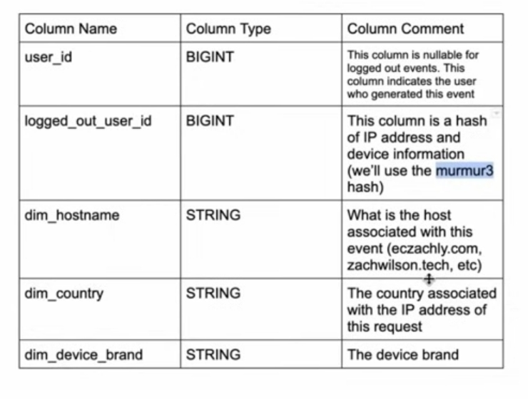
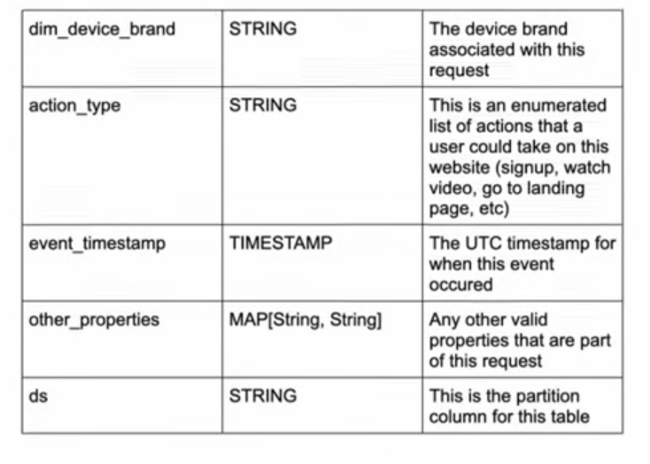
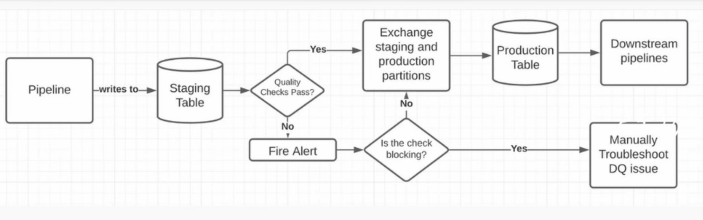
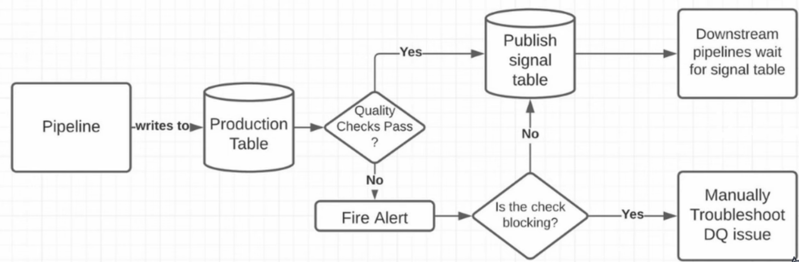
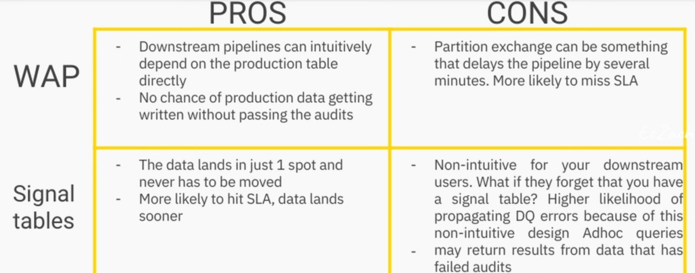

# Free Data Engineer Bootcamp from Zach

source: [The ultimate YouTube DE boot camp](https://github.com/DataExpert-io/data-engineer-handbook/blob/main/bootcamp/introduction.md)

## Lecture 1
+ Data Quality means
  - Discoverable: Data Catalog, Single source of truth
  - Incomplete definitions of data: Rare events-Pandemic, Missing other factor -> mislead decisions
  - No null or duplicate
  - There is busniess value being derived from the data: data insight to make more or less valuable decisions
  - easy to use: column name is easy to read-dim_ for dimension, m_ for measure etc
  - data arrivesin a timely manner (both sides agree the interval)
+ How do you build high trust in data sets
  - Ask downstream stakeholders "if cost and time wasn't an objection, which data do you want" to understand what they want to solve and its big picture for the next 3months/ 6months/ year -> set correct direction for a roadmap
    - other questions like current and future needs
    - don't create a pipeline for every narrow questions asked by analysts like specific data in US in 2008
  - Spec review of the pipeline design by self/ other experienced data experts (1-2 people)/ downstream stakeholders
  - able to clarify the business impact of the pipeline before coding -> might help in promotion
  - Airbnb's MIDAS process:
    - Guideline to create a good pipeline
    - more references
      - [midas data process](https://www.secoda.co/glossary/midas-data-process)
      - [Data Quality Score: The next chapter of data quality at Airbnb](https://medium.com/airbnb-engineering/data-quality-score-the-next-chapter-of-data-quality-at-airbnb-851dccda19c3)
      - [The Hidden Platform Lesson Behind Airbnb’s Data Quality Framework](https://packtcloudpro.substack.com/p/the-hidden-platform-lesson-behind)
    - 9 steps
      - no need to force to do all processes, just take some processes to apply to the company
      1. Design Spec: a purpose of pipeline, tech to build it
          - Good design spec
            - Description: to tell the pipeline's purpose
            - Flow Diagrams: show how data move from source to destination (raw data -> fact dimension model -> staging data -> production)
              
            - Schemas: SQL DDL->Name convention = column name (dim, fct, scd, agg, m) + column type + column comment (description)
            - Quality checks: Show how it tests and its result
              - type of check
                - basic check: no null, no duplicate, enum values are valid
                - intermediate check:
                  - row count(per day) okay?
                  - Week over Week row count cut by dimensions okay? (this sunday vs last sunday is more controlled than sunday vs monday)
                  - Business rules enforced?
                  - year over year row count okay?
                - advanced check: seasonality adjusted row count okay?
              - dimension vs fact
                - dimension:
                  - Grow or are flat day over day -> "Table is growing check" is very common
                  - Don't grow sharply (percent difference from last week should be small)
                  - Have complex relationship like foreign keys in SQL
                - fact:
                  - have a seasonality to them (like week-over-week, careful about day-over-day because it can impacted from holidays)
                  - can grow and shrink based on user behaviour
                  - prone to duplicate/ null/ row-level issue so must have check for all of these
                  - have references to entities in dimensional table (foreign key)
                  - for Presto, use APPROX_COUNT_DISTINCT instead of COUNT(DISTINCT)
            - Metric Definitions: What to measure from these metrics
            - Example Queries: save time to answer how to query this
      2. **Spec Review**: technical review and stakeholders review
      3. Build and Backfill Pipeline: Coding part (Airflow, Spark) and backfilling should start from a month ago (for testing if they want more) or as requested
      4. SQL Validation: downstream stakeholders (not the one who created it) check if there is any weird data 
      5. Minerva Validation: use Minerva metrics (open source) to evaluate the pipeline
      6. **Data Review & Code Review**: Data review (again) in the team and Code review before its deployement (CI/CD, unit test, integration test, end-to-end test)
      7. Minerva Migration: migrate Minerva metrics
      8. **Minerva Review**: reviewed by data scientists if the metrics are good
      9. Launch PSA
    - These processes will make stakeholders feel they are part of the pipeline -> reduce some blame and prevent to do new backfilling (probably)
      - data I/O cost is expensive and it will double when doing the new backfilling
    - When to do these 9-step processes
      - data is not going to change within a year, the pipeline must be used for a couple years
      - want to explore data quickly, so it isn't worth to give the effort for this kind of pipeline

## Lab 1
+ Example of questions
  - how many people visit the website? what is the geographical and device break down of the traffic? which social media are these people coming from?
  - how many people are signing up? what percentage of traffic is converting to signing up?
  - how many people are purchasing products? what percentage of signups convert to paying customers?
+ Business Metrics:
  - metric name: e.g signup_conversion_rate
  - definition: formula to calculate the metric e.g. count(signups) / count(website_hits)
  - is guardrail: metric that signify a problem to a business that is really bad -> if it's guardrail, it means all activities that reduce this metric can't be launched
    - signup_conversion_rate is guardrail because the website needs users
    - traffic_breakdown is not guardrail because it is not important where people are coming from, just converting those into members is okay
+ Flow Diagram
  - use color to tell which is logs(source), fact table, dimension table, aggregated table, metric table
  - source (storage): database, data lake, website 
  - process: e.g. from the example questions
    - want to know about IP location -> extract and label raw data (transform)
    - want to know which device people are using -> like above step
  - fact/dimension storage [core storage]: store what is already transformed from the source
  - aggregated storage [core storage]: store what is aggregated from the fact/dimension
  - metric storage: store what is queried from the aggregated (based on questions)
+ Schemas
  - Description of the storage like what it is for and what it stores etc.
  - Example    
    
    
    
  - Quality check: example
    - Not Null check: column1 column2
    - No duplicate on Primary key check: columnA
    - Format check: column1 must be in www.aaaaa.com
    - row count check
      - grouped by column1, then check week-over-week counts for www.aaaaa.com and www.bbbb.com
    - Enumeration check: column3 (must have these values: signup, login, purchase, etc)
    - total_events should be more than set minimum number ... etc

## Lecture 2
+ What causes bad data?
  - Logging errors -most about fact data: null data from no required field, duplicate data from not disabling submit button
  - Snapshotting error -most about dimensional data (rare): problem when snapshotting like missing some dimension/ user or duplicate users
  - Production data quality issue: incorrect data on production needs to investigate and mostly with software engineer
  - Schema evolution issue: data from both sides: collector (from app) and storage (data lake) doesn't match
  - Pipeline mistake making it into production: lack communication with downstream when the error pipeline is deployed or not giving proper review 
  - Non-idempotent pipelines and backfill errors: backfilling non-idempotent pipeline will cause errors
  - Not thorough enough validation:
    1. Because only data engineer can't do this alone, need data analyst or scientist or data expert
    2. Third party data providers can change their policy or data schema
+ Validation best practices
  - try backfilling a small amount of data (~ 1 month)
  - always have someone else to check all assumptions (avoid own bias)
  - produce a validation report: duplicate, null, violation of business rule, time series/ volume
+ Data contract - data involved in production (data or data storage or pipeline)
  - To reduce mistakes as many as possible before its deployement (bad data propagation, the more downstream consumers, the bigger issue)
  - component in the contract: schema, quality check result, how data shows up in production
  - Types
    - WAP - write, audit, publish
      
    - Signal table (less I/O cost to production table)
      
    - Pros and Cons
      

+ Bad Metric definition can cause bad data
  - The more different data points and dimensions your metric depends on, the more prone it is to error
    - like metric for very specific user "convertion rate to users of female aged around 15-23 who lived in Kansus in every first quarter"

