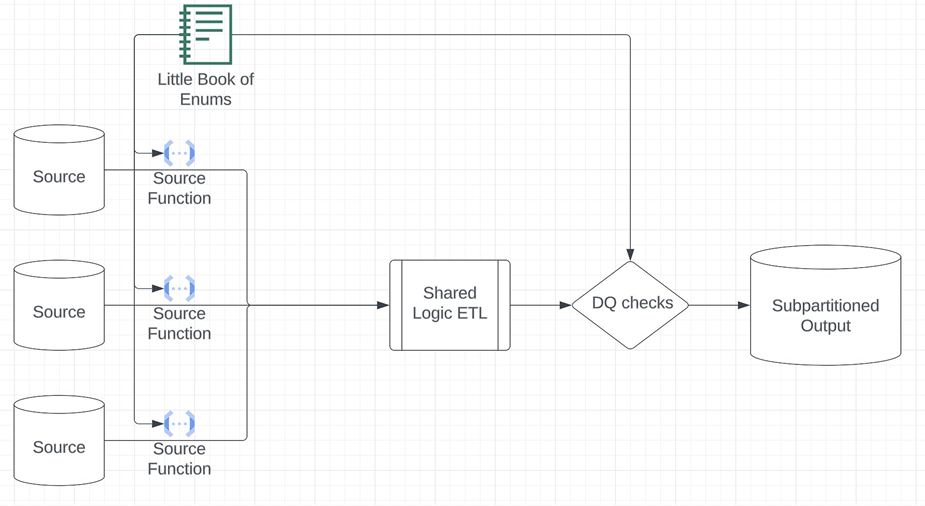
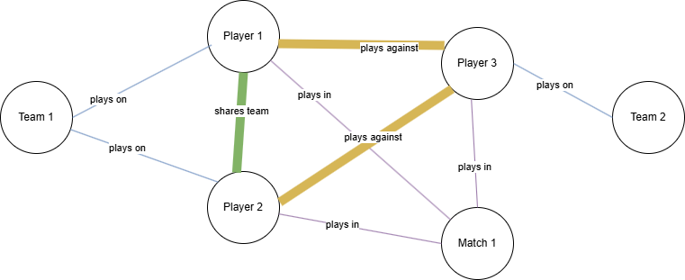

# Free Data Engineer Bootcamp from Zach

source: [The ultimate YouTube DE boot camp](https://github.com/DataExpert-io/data-engineer-handbook/blob/main/bootcamp/introduction.md)

## Lecture 1
### Dimensional Data Modeling
Dimensions are attributes of an entity like user's birthdate, user's tel number or user's ID (which can be used to identify the user (entity))

Dimensions have two types
1. Slowly-Changing (time-depended such as phone number)
2. Fixed (such as birthdate)

Before start doing something, need to know your consumer to set goals for what you are doing
- data that is easy to query, not many complex data types for data scientists, data analysts
- data that is probably harder, compact for other data engineers (nested query is stll fine)
- cleaned and well-formatted data for specific ml models
- data for creating charts

#### OLTP vs OLAP vs Master data
- OLTP: optimizes for low-latency, low-volume queries
    - normalized database for web/ mobile app
- OLAP: optimizes for large-volume, groupby queries, minimizes joins
    - denormalised data in data warehouse
- Master data: optimizes for completeness of entity definitions, deduplicated, normalized 

***OLTP and OLAP is a continuum***

Production database snapshots (many tables) -> Master data (have a table that collects all important data, still have others) -> OLAP (a table for DS or DA) -> Metrics (charts that show aggregated values)

***Example***
- Cumulative table design
    - table that hold historical data as well as current data
    - core components
        - yesterday dataframe and today one
        - full outer join the two tables
        - coalesce null values to choose only users who have been active since yesterday
        - hang onto all of history
    - usage
        - growth analytics (dimension table of all users -> being used by all downstream consumers)
        - state transition tracking ( yesterday-used/ today-miss -> churn, yesterday-missed/ today-use -> resurrected)
    - diagram
        - yesterday + today -(full outer join)-> coalesce ids and unchanging dimensions, compute cumulative metrics (days since x), combine arrays and changing values -> cumulated output
    - strengths
        - historical analysis without shuffle data (select data from a table without using join)
        - easy transition analysis for checking who is currently active
    - drawbacks
        - only be backfilled sequentially (not able to backfill in parallel)
        - handling PII (Personally identifiable information) can be a mess as another table is needed to check if users delete their account or is inactive for too long

#### Compactness vs Usability
- the most usable tables: 
    - no complex data types, easy to be manipulated with where and group by
    - majority of consumers are less technical
- the most compact tables: 
    - compressed to be as small as possible,  need to be decoded before use (not suitable for basic features like calendar as network I/O overhead and a waste of decoding time)
    - minimize data size as much as possible for a large number of users
    - online systems where latency and data volume matter a lot for technical consumers
- the middle group tables: 
    - use complex data types (array, map, struct), making querying trickier but smaller in size
    - upstream staging or master data for other data engineers 

#### Struct vs Array vs Map
- Struct (a table inside of a table)
    - **Keys are rigidly defined**, compression is good
    - Values can be any type
- Map
    - Keys are loosely defined, compression is okay -> flexible
    - Values all have to be the same type
- Array
    - Ordinal (a ordered list)
    - List of values that all have to be the same (e.g. array of string, array or map/ struct, etc)

A diaster from denormalizing a compressed data (temporal dimension) that would need to join other dimensions with spark shuffle is a messy order of compressed data

### Lab 
```
-- postgresql
-- create struct
create type struct_name as (
    data1 integer,
    data2 real
)
-- create enum 
create type enum_name as enum('high', 'medium', 'low')
-- create new cumulative table with the struct
create table cumulative_table (
    id integer,
    data1 integer,
    data2 text,
    struct_name struct_type[] (struct_name can be struct_type)
    primary key(id, data1)
) 
-- insert data into cumulative table 
with yesterday as (
    select * from yesterday_table
    where current_date = 'yesterday'
),
    today as (
    select * from today_table
    where date = 'today'
    )
-- case 1 no yesterday data but have today data, case 2 have both data, case 3 no today data but have yesterday data
-- double colon = cast in postgresql
insert into cumulative_table
select 
    coalesce(t.data1, y.data1) as data1,
    coalesce(t.data2, y.data2) as data2,
    coalesce(t.data3, y.data3) as data3,
    case when y.struct_name is null
    	then array[row(
    		t.data_in_struct1,
    		t.data_in_struct2
    	)::struct_type]
    when t.date is not null
        then y.struct_name || array[row(
     		t.data_in_struct1,
    		t.data_in_struct2
    	)::struct_type]
    else y.struct_name
    end as struct_name
    coalesce( t.date, y.current_date +1) as current_date
from today t full outer join yesterday y 
    on t.data1 = y.data1

-- unnest array
with unnested as (
select data1,
-- split array into rows of the struct
    unnest(struct_name::struct_type) as struct_name
from cumulative_table
where date = 'specific date' and data1 = 'abc'
)
-- split struct into columns 
select data1, (struct_name::struct_type).*
from unnested

-- slicing index of array (array_name is struct_name)
select data1,
    (array_name[1]::struct_type).data_in_struct1 --first item in array
    (array_name[cardinality(array_name)]::struct_type).data_in_struct1 --last item in array
-- benefits from array is faster than group by
-- normal way: need group by to find min, max of the same data1 
```


## Lecture 2
### Dimensional Data Modeling
#### Idempotent Pipelines
A pipeline that whenever it's executed with the same input, it must produce the same output whether in production or backfilling

Non-idempotent pipelines are hard to troubleshoot
- it is silent failure (not alert) and makes data inconsistency
- what can make them
    - INSERT INTO without TRUNCATE makes duplicated data
        - Use MERGE (do nothing to old data, if matched) or 
        - Use INSERT OVERWRITE (guarantee no duplicate, might be better in processing speed than merge)
    - Using "> start_date" without a corresponding "< end_date" might cause out-of-memory exception
    - Not using a full set of partition sensors (= using incomplete set of data)
        - pipeline might run when there is no/partial data
    - Not using depends_on_past (sequential processing) for cumulative pipelines 
        - cumulative pipelines can't process in parallel because it needs previous data to be written already
    - Relying on the **latest** partition of a not properly modeled SCD table
        - DAILY DIMENSIONS is needed, so the latest partition from pipelines is used for that 
            - but there might be a bug at dimension table of all users which doesn't update properly 
            - today data hasn't been added yet so the downstream pipeline uses yesterday data again
            - low latency, but bad data quality 
        - Cumulative table design **AMPLIFIES** this bug (bug will get bigger and bigger as time passes)

The pains of not having idempotent pipelines
- Backfilling causes inconsistencies between the old and restated data
- Very hard to troubleshoot bugs 
- Unit testing cannot replicate the production behavior as the results aren't the same every time 
- Silent failures

Slowly Changing Dimensions is the best when data changes slowly
    - not suitable for 
        - Latest snapshot
        - Daily/Monthly/Yearly snapshot depended on some dimensions

How can you model dimensions that change?
- Singular snapshots (only latest snapshot available)
    - BE CAREFUL SINCE THESE ARE NOT IDEMPOTENT (data might change while do backfilling)
- Daily partitioned snapshots
- SCD Types 1,2,3

#### Slowly-changing Dimension
types of Slowly Changing Dimensions
- Type 0 
    - data is fixed, unchanged (e.g. birthdate)
    - IDEMPOTENT because the values are unchanging
- Type 1
    - keep only the latest value
    - NOT IDEMPOTENT as the result in the past mightn't be the same to the current result with the data when backfilling
    - noted: probably fine with online app that use transational database
- Type 2
    - care about what the value was from start_date to end_date
    - Current values usually have either an **end_date** that is:
        - NULL 
        - Far into the future like 9999-12-31
        - 1 more column for keeping current value 
    - Hard to use:
        - Since there's more than 1 row per dimension, you need to be careful about filtering on time
    - IDEMPOTENT but still need to care about start_date and end_date
- Type 3
    - only care about original (historical data) and current date
    - Benefits
        - You only have 1 row per dimension
    - Drawbacks
        - You lose the history in between original and current
    - NOT IDEMPOTENT, impossible to know when to pick original vs current 

SCD2 Loading
    - Load the entire history in one massive query
        - Inefficient but nimble -quick
        - 1 query and you're done
    - Incrementally load the data after the previous SCD is generated (cumulative)
        - Has the same depends_on_past constraint
        - Efficient but cumbersome -use more time and effort

Reality 
when start doing something, there is a trade off between convenience/ high efficiency and opportunity cost (time, effort, money)

### Lab
```
-- postgresql
-- compare previous row with lag
select data1, 
	lag(interesting_data1, <offset> ) over (partition by data1 order by data2),
	lag(interesting_data2, 1 ) over (partition by data1 order by data2)
from table

-- '<>' = '!=' in postgresql 
select data1 <> data2 or data1 is null (will return true/ false)
from table
-- have start_date, end_date for scd2 and might have current_date as indicator for being active now 
```


## Lecture 3
### Dimensional Data Modeling
Additive dimensions mean that you don't double count, the dimensions can only be one value at a specific window of time whether it's small window or big
- Age is additive: Two ages can't be one person
- Application interface is NOT additive: There is a chance for a user to be in two groups; # active users != # of users on web + # of users on Android + # of users on iPhone 
- Counting drivers by cars is also NOT additive: Honda civic and accord can have the same owner 

How does additivity help? 
- don't need to use COUNT(DISTINCT) on preaggregated dimensions
- In case of non-additive dimensions, they depends on which aggregate function is used 
    - e.g. They are usually only non-additive with respect to COUNT aggregations (including ratio metric) but not SUM aggregations

When should you use enums? 
- Enums are great for low-to-medium cardinality (less than 50 items)
    - Country is a great example of where Enums start to struggle.

Benefits from using enums
- Built in data quality (easy to detect anomaly when cast to enum type)
- Built in static fields
- Built in documentation (easy to understand when reading document)

Enumerations and subpartitions
- Enumerations make amazing subpartitions because
    - You have an exhaustive list (detailed can complete)
    - They chunk up the big data problem into manageable pieces (easier to edit enums that the whole table)
- [pipeline creation guideline?](https://github.com/EcZachly/little-book-of-pipelines)


- the book of enum makes it easy to do data quality check
- it also helps in data consistency when using the source function to create the value from enum


This enum pattern is useful when there are tons of sources mapping to a shared schema
- Airbnb:
    - Unit Economics (fees, coupons, credits, insurance, infrastructure cost, taxes, etc)
- Netflix:
    - Infrastructure Graph (applications, databases, servers, code bases, CI/CD jobs, etc)
- Facebook:
    - Family of Apps (oculus, instagram, facebook, messenger, whatsapp, threads, etc)
- Japaness Car
    - Brands (Toyota, Honda, Suzuki, etc) -> car_id, brands, plant_country, specific_properties??

Flexible schema is suitable for data modelling from disparate (different) sources into a shared schema
- Benefits
    - You don't have to run ALTER TABLE commands to add columns
    - You can manage a lot more columns but it still has a limit 
    - Your schemas don't have a ton of "NULL" columns from unmatched columns from each table
    - "Other_properties" column is pretty awesome for rarely-used-but-needed columns (to use map to keep the unmatched columns??)
- Drawbacks
    - Compression is usually worse, (especially if you use JSON as it needs space for key and value)
    - Readability, queryability 

Graph modeling is RELATIONSHIP focused, not ENTITY focused. (flexible) 
- Usually entities/ nodes in model should have 
    - Identifier: STRING
    - Type: STRING
    - Properties: MAP<STRING, STRING>
- For edges of nodes, they would have 
    - subject_identifier: STRING 
    - Subject_type: VERTEX_TYPE 
    - Object_identifier: STRING
    - Object_type: VERTEX_TYPE 
    - Edge_type: EDGE_TYPE
    - Properties: MAP<STRING, STRING>

### Lab



subject = players, object = teams/ games
- creating relationship between subject and object is easy as it is not bidirectional   
- but creating relationship between two subjects is harder because it is bidirectional, making duplicate rows (sub1 -> sub2, sub2 -> sub1) 
